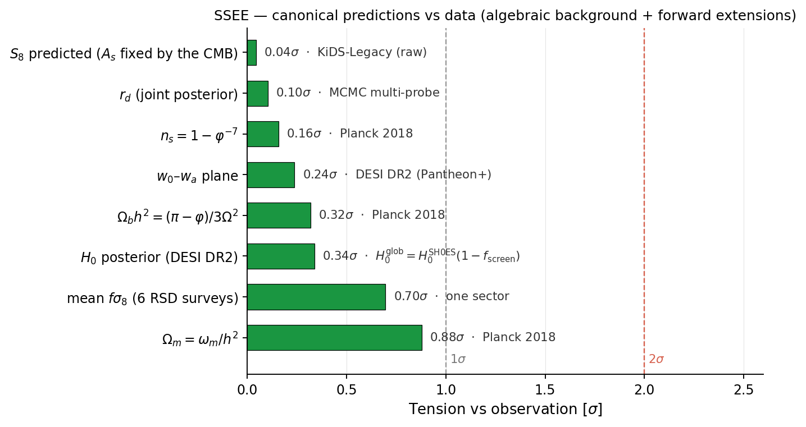

<div align="center">


# SSEE — Structural Self-Energy Expansion

### A minimal-parameter dark energy framework derived from φ and π

[](https://doi.org/10.5281/zenodo.20093447)
[](LICENSE)
[](requirements.txt)
[](docs/)
[](VERIFICATION_LEDGER.md)
[](OPEN_PROBLEMS.md)


*The algebraic point (w₀, wₐ) = (−0.840, −0.670) — derived from φ and π with zero fitting — vs the official DESI DR2 w₀wₐCDM contours: **0.24σ** (DESI+CMB+Pantheon+), and within **1.2–1.5σ** of the DESY5/Union3/no-SN combinations (arXiv:2503.14738, eqs. 25–28).*

</div>

**A minimal-parameter dark energy framework derived from φ (golden ratio) and π. The background sector $(w_0, w_a, \Omega_\mathrm{DE}, \Omega_{m,\mathrm{dyn}})$ carries zero fitted dimensionless parameters; the framework rests on 3 postulates (D, S fundamentals + I auxiliary register-level; the former matter-factor postulate M was dissolved in the ωm-direct reframe, OP-8 closed) plus open problems tracked in [`OPEN_PROBLEMS.md`](OPEN_PROBLEMS.md). Tested against DESI DR2 BAO, Planck 2018 CMB (TT+TE+EE+lensing), galaxy cluster masses, and large-scale structure growth.**

---

## 🎯 Falsifiable predictions — current status

| Observable | SSEE (algebraic) | Observed | Separation | |
|---|---|---|---|---|
| (w₀, wₐ) | (−0.840, −0.670) | DESI DR2+CMB+Pantheon+: (−0.838±0.055, −0.617±0.208) | 0.24σ (2D); range 0.2–1.8σ across SN compilations (official chains) | ✅ |
| CMB first peak | ℓ₁ = 221 | Planck 2018: ~220 | Δℓ = 1 | ✅ |
| Ωm,CMB | 0.30889 (= ωm/h², ωm-direct) | Planck 2018: 0.3153 | 0.88σ | ✅ |
| n_s | 1 − φ⁻⁷ = 0.96556 | Planck 2018: 0.9649 | 0.16σ | ✅ |
| αT (GW speed) | 0 exact | GW170817: \|αT\| < 10⁻¹⁵ | exact match | ✅ |
| **S₈ (single sector, A_s FIXED by the CMB — no free cosmological parameter)** | **0.8273 predicted** | KiDS-Legacy: 0.8265±0.0176 | **0.04σ** | ✅ |
| S₈ — earlier, superseded: KiDS-1000, A_s free, MCMC vs raw ξ± | 0.7559 ± 0.0189 | KiDS-1000: 0.759±0.024 | 0.10σ | ✅ |
| c_s² (dark-energy sound speed, Paper 7) | (M_v−T_r)/(5M_v+3T_r) = 0.021284 | not yet constrained | the falsifiable content of the EFT sector is c_s² and w₀; α_K is not observationally accessible (Paper 7) | ⏳ |
| **(w₀, wₐ) vs DESI DR3** | **same fixed point (−0.840, −0.670)** | **DR3 w₀wₐCDM (2027)** — trajectory 0.05σ (DR1) → 0.24σ (DR2, errors −40%, still inside 68%); ~0.5σ expected if DR2 centrals persist; >3σ joint exclusion falsifies | **pre-registered** | ⏳ |

**Future falsifiers:** r = φ⁻¹⁰ = 0.00813 (LiteBIRD ~2032).

> **S₈ against KiDS-Legacy (2026-09-20)** (357 raw ξ± points; Wright et al.
> 2025, [arXiv:2503.19441](https://arxiv.org/abs/2503.19441) — published sixteen
> months before this analysis, **no temporal priority is claimed**). The shear
> asks for log(10¹⁰A_s) = 3.0255 ± 0.0396 against the 3.04483 the CMB fixes
> *under the same algebraic background*: **0.49σ** (Planck background, held
> equally rigid: 1.01σ). So A_s need not be refitted at all — fixing it costs
> nothing (χ² = 417.97 with **eight free parameters, all nuisance, none
> cosmological**, vs 418.34 with A_s free; ΔBIC = +6.24), and S₈ = 0.8273
> becomes a *prediction* against 0.8265 ± 0.0176 measured. **Two cautions, in
> the open:** the three χ² compared span 1.0 over 357 points, so the shear does
> **not** discriminate between these models — what separates them is the
> parameter count; and KiDS-1000 had asked for log(10¹⁰A_s) = 2.864 ± 0.050,
> 3.5σ away, with the two releases differing from each other by 2.5σ. What
> changed is the data, not the model: KiDS-Legacy recalibrated the source
> redshift distributions n(z), and re-running the KiDS-1000 analysis under
> blinding with the new calibration alone takes the Planck–shear disagreement
> from 2.39σ to 1.42σ (Wright et al. 2025, A&A 703, A158, Appendix I). The
> credit for finding and correcting that systematic is the KiDS collaboration's. A
> future release returning to the lower amplitude would reopen the sector.

Earlier versions of this project contained a second dark-matter sector and a light
particle, and a Planck-normalised "3.5σ S₈ challenge". Both are retracted; the
reasons are documented in [RETRACTIONS.md](RETRACTIONS.md).

---

## 📄 Papers

| # | Title | Pages | Status | PDF |
|---|---|---|---|---|
| 1 | A Minimal-Parameter Framework for Cosmological Dynamics and Galaxy Cluster Mass Discrepancies via Structural Self-Energy Expansion (SSEE) | 35 | arXiv-ready | [docs/](docs/SSEE_Paper1_Framework.pdf) |
| 2 | Bayesian MCMC Validation of SSEE — Model Comparison against ΛCDM and CPL using DESI DR2, Planck 2018 and Galaxy-Cluster Mass Data | 31 | arXiv-ready | [docs/](docs/SSEE_Paper2_MCMC.pdf) |
| 3 | SSEE and the CMB Power Spectrum — Acoustic Peak Reproduction via the ω_m-Direct CMB Matter Density | 26 | arXiv-ready | [docs/](docs/SSEE_Paper3_CMB.pdf) |
| 4 | SSEE as a Two-Axiom Cosmology — Algebraic Derivation of the CMB Background from φ and π | 19 | Preprint | [docs/](docs/SSEE_Paper4_ToE.pdf) |
| 5 | Israel-Stewart Causal Viscous Perturbations in the SSEE Dark Energy Framework — Exact Marginal Stability, ΛCDM-Consistent Structure Growth, and the Amplitude Ceiling *(the two-sector matter section is RETIRED, 2026-08-01)* | 31 | Preprint | [docs/](docs/SSEE_Paper5_IS.pdf) |
| 6 | SSEE and the Growth Sector Re-examined — No Second Matter Component, and No S₈ Tension, on Raw Survey Data *(rewritten 2026-08-01; the φ-DM version is retired to `archive/`)* | 17 | Preprint | [docs/](docs/SSEE_Paper6_Growth.pdf) |
| 7 | The SSEE Dark-Energy Sector as a Ghost Condensate — Two-Term K-essence, Algebraic Sound Speed, and Bellini-Sawicki Classification *(β_c = −AURA RETIRED 2026-09-07; the correctly normalised shooting gives β_c = +0.235068, `results/logs/fondos_exponenciales.json`, and the coupling left Paper 7 with the potential)* | 17 | Preprint | [docs/](docs/SSEE_Paper7_EFT.pdf) |
| 8 | SSEE in the Strong-Gravity Regime — Disformal Geodesics, MIRA Emergence, and k-mouflage Screening | 19 | Preprint | [docs/](docs/SSEE_Paper8_StrongGravity.pdf) |
| 9 | SSEE and the Hubble Tension — An Algebraic Local Screening Fraction | 22 | Preprint | [docs/](docs/SSEE_Paper9_HubbleTension.pdf) |
| 10 | UV Extension of SSEE Dark Energy: M⁴ = 45α²ρ_crit = 5φ⁸ρ_crit, and a Conditional Self-Consistency Check on the Hubble Tension | 16 | Preprint | [docs/](docs/SSEE_Paper10_UVCompletion.pdf) |
| — | **Unified Journal Paper** (consolidation of Papers 1–10 + CLASS + MCMC Phase 4) | 24 | Journal submission candidate | [docs/](docs/SSEE_Unified_Journal.pdf) |
| ★ | **Sealed Journal** — consolidated late-universe dark-energy paper (φ → w₀, wₐ; closed-dictionary look-elsewhere; two-stage H₀; honest accounting of ~3 vs 6 parameters) | 21 | **Sealed — external-audit candidate** | [docs/](docs/SSEE_Sealed_Journal.pdf) |

---

## 🗂️ Repository structure

<details>
<summary><b>Click to expand the full repository tree</b></summary>

```
SSEE/
├── manuscript/                     # LaTeX sources, bibliographies, cover letters
│   ├── SSEE_Paper1_Framework.tex … SSEE_Paper10_UVCompletion.tex  # the 10 papers
│   ├── SSEE_EFT_section.tex        # EFT section (\input by Paper 1)
│   ├── SSEE_Unified_Journal.tex    # consolidated journal paper (Papers 1–10)
│   ├── SSEE_Endorser_Summary.tex   # 2-page arXiv endorser brief
│   ├── *.bib                       # ssee_paper3/4/5/6 + ssee_unified bibliographies
│   └── cover_letter_*.txt, abstracts_arXiv.txt
├── src/                            # Python scripts — organized per paper
│   ├── p02_mcmc/ … p10_uv/         # per-paper analysis, MCMC, figures (p02_mcmc, p03_cmb,
│   │                               #   p04_toe, p05_IS, p06_phiDM, p07_eft, p08_stronggrav,
│   │                               #   p09_hubble, p10_uv)
│   ├── pB_inflation/               # Paper B groundwork (baryogenesis, N_*)
│   ├── estadistica/                # Bayesian model-selection phases (DIC, Savage-Dickey, cross-val)
│   ├── mcmc_full/                  # full Cobaya CAMB+PPF pipeline (heavy chains → /mnt/datos)
│   ├── verificacion/               # ssee_verify.py guardian + CANONICAL sync + core constants
│   └── ssee_core.py                # single algebraic source (φ, π → all constants)
├── class_ssee/                     # CLASS Boltzmann fork — SSEE .ini configs + plot scripts
├── data/                           # observational data (DESI DR2, Planck 2018, clusters)
├── results/                        # generated figures, tables, logs
├── notebooks/                      # Jupyter exploration
├── docs/                           # compiled PDFs — 10 papers + endorser + unified journal
├── submission_packages/            # arXiv-ready .tar.gz bundles per paper
├── archive/                        # superseded drafts (historical)
├── notes/                          # internal work-notes & attack plans (not load-bearing)
├── archive/codigo/build_arxiv_packages.py  # regenerates submission_packages/ (moved to archive/)
├── requirements.txt · environment.yml   # reproducible Python environment
├── OPEN_PROBLEMS.md                # physics gaps OP-1..OP-19 with status
├── AUDIT.md                        # reproducibility guide + known limitations
├── CHANGELOG.md · CITATION.cff · LICENSE
└── (eftcamb_ssee/ — EFTCAMB fork, not versioned: clone separately)
```

</details>

---

## ⚙️ How to reproduce

Standard install (all dependencies pinned):
```bash
pip install -r requirements.txt
```

**Portability — runs from any machine.** Scripts derive all in-repo paths from their
own location (no hardcoded absolute paths). Heavy MCMC chains (~GB) default to a
large disk when present, else to `results/data/`. Override the output location with:
```bash
export SSEE_DATA_DIR=/path/to/large/disk    # optional; default is portable
```

**Paper 2 — MCMC validation** (100-walker, N_eff ≈ 637,500 for SSEE):
```bash
python src/p02_mcmc/ssee_paper2_mcmc.py
```

**Paper 3 — CMB power spectrum** (Cobaya MCMC, TT+TE+EE+lowl):
You can set the `COBAYA_PACKAGES_PATH` environment variable to point to your local Planck 2018 data:
```bash
export COBAYA_PACKAGES_PATH=/path/to/your/cobaya_packages
python src/p03_cmb/ssee_paper3_cobaya_unified.py
```

See [AUDIT.md](AUDIT.md) for expected outputs and known limitations.

---

## 📊 Key results

<div align="center">

</div>

### Paper 2 (DESI DR2 + Planck 2018 + clusters)

| Metric | Value |
|---|---|
| χ²_2D (w₀-wₐ vs DESI DR2+CMB+Pantheon+) | 0.42 → 0.24σ (2D); 1.47σ DESY5, 1.77σ Union3 (ρ medidos de cadenas oficiales) |
| Clusters, 46 real systems of Zhang+2026 (GR, M_dyn = (ω_m/ω_b)·M_bar = 6.364·M_bar, no free parameter) | IGIMF: SSEE 2.32σ vs ΛCDM 2.41σ · canonical IMF: 8.64σ vs 8.46σ — clusters test the baryon census, not the background (`results/logs/cumulos_zhang2026.json`) |
| H₀ SSEE (MCMC, prior H_glob = SH0ES·(1−f_screen) = 67.962 ± 0.968, DESI DR2) | 67.82 ± 0.41 km/s/Mpc (0.68σ Planck, **0.33σ de H_glob** — DR2 compatible con la predicción; ω_m algebraico fijo, r_d CAMB) |
| ΔBIC (SSEE k=2 vs ΛCDM k=3) | −7.25 (SSEE favoured; CPL −6.14; ΔDIC -6.47; Savage-Dickey ln B = 2.34; 2026-10-01 sin el término de cúmulos que solo llevaba SSEE; cross-val SSEE predice mejor que ΛCDM) — `results/logs/resumen_3modelos.json` |
| r_d SSEE / χ²_r(H(z)) | 147.17 Mpc (CAMB, 0.32σ Planck) ≈ ΛCDM-Planck 147.10 / 0.479 ≈ ΛCDM 0.459 (3 modelos, `mcmc_paper2_3models_wmfix.log`) |

### Paper 3 (Planck 2018 CMB)

| Spectrum | SSEE χ²_r | ΛCDM χ²_r | N |
|---|---|---|---|
| TT | 1.042 | 1.043 | 1971 |
| TE | 1.040 | 1.040 | 1967 |
| EE | 1.040 | 1.039 | 1967 |
| PP (lensing) | 0.720 | 0.757 | 9 |
| Combined (diagonal) | **1.040** | 1.040 | 5914 |
| ΔBIC (full plik MCMC, TTTEEE+lowl+lensing, k=2 vs k=6, N=2354) | **−33.83** (SSEE decisively favoured — **canonical**; minimum χ², `results/logs/b1_k2.json`) | — | — |
| ΔBIC (plik_lite point est., TTTEEE, k=2 vs k=6, N=613) | **−24.0** (cross-check) | — | — |
| ΔBIC (diagonal TT+TE+EE+PP, k=2 vs k=6, N=5914) | **−35.0** (cross-check) | — | — |

*All values are the canonical ωm-direct CMB fit at the global anchor H₀ = 3(φ+π)² = 67.962, with Ω_m,CMB = ω_m/h² = 0.30889 derived algebraically (no matter-rescaling factor; OP-8 dissolved). SSEE uses its canonical Σm_ν = 0.06849 eV; ΛCDM uses its standard Planck baseline Σm_ν = 0.06 eV (each model with its own neutrino mass — the fair like-for-like comparison). The **titular ΔBIC = -33.83** comes from the full `plik` likelihood with the minimum χ² of each model (χ² = 2768.4 vs ΛCDM 2771.2, Δχ² = -2.78 — indistinguishable fits, parsimony-driven; `results/logs/b1_k2.json`). The earlier `plik_lite` Cobaya legacy-MIRA scan (ΔBIC −32.2 at optimum H₀=67.037) is superseded.*

**Growth structure (Paper 3 §5.4–5.5):**

| Metric | SSEE | ΛCDM |
|---|---|---|
| Growth index γ_IS (Paper 5, supersedes App.A) | 0.5504 ± 0.001 | 0.55 |
| S₈ (IS, single-sector ceiling) | 0.827 | 0.830 |
| fσ8 χ²/N (6 canonical RSD surveys) | **0.766** | 0.860 |

### Paper 5 (Israel-Stewart Causal Perturbations)

| Result | Value | Status |
|---|---|---|
| c²_s,eff | 0 (exact algebraic) | Q1: all modes stable |
| k_crit / (H₀/c) | 0.456 < 1 | Sub-Hubble stability window |
| R = Ω_m,eff/Ω_m (k≥10) | 0.9897 ± 0.0167 | Cota a la agrupación de EO: |r| ≤ 0.0175, 3.9% de r*=0.4464 |
| γ_IS | 0.5504 ± 0.001 | ≈ γ_ΛCDM = 0.55 |
| G = D₁_SSEE/D₁_ΛCDM | 1.0032 ± 0.005 | ~0.3% enhancement (Poisson source Ω_m,CMB = 0.30889) |
| σ₈_SSEE (single-sector ceiling) | 0.8149 ± 0.006 | ODE linear growth gives 0.8136 |
| S₈ with A_s fixed to **Planck** (ceiling, not a prediction) | 0.827 | imports the Planck–KiDS offset; the model's own prediction fixes A_s to its **own** CMB fit — see Paper 6 |
| Mean fσ₈ tension (6 surveys, single-sector) | 0.70σ | ≈ ΛCDM (0.73σ); fσ₈ against raw BOSS multipoles is in progress |

### Paper 6 (Growth against raw data — single sector)

| Result | Value | Status |
|---|---|---|
| Ω_m = ω_m/h² (one matter sector, no partition) | 0.308881 | ω_m-direct; the same value enters background and growth |
| Σm_ν = R₂ × 0.9530 eV | 0.0685 eV | R₂ = Ω/(KAL·TRIAL) = 0.071875 (ν-closure C=93.14) |
| **S₈, A_s fixed to the model's own CMB fit (no free cosmological parameter), raw KiDS-Legacy ξ±** | **0.8273 predicted** | **0.8265 ± 0.0176 measured — 0.04σ.** χ² = 417.97 on 357 points, 8 free parameters (all nuisance); ΔBIC = +6.24 over A_s free |
| log(10¹⁰A_s) asked by the shear, A_s free (KiDS-Legacy) | 3.0255 ± 0.0396 | 0.49σ from the 3.04483 fixed by the CMB under the same background (Planck background: 1.01σ) |
| σ₈, S₈ (A_s free, MCMC vs raw KiDS-1000 ξ±) | 0.7449 ± 0.0186, 0.7559 ± 0.0189 | 0.10σ; ΛCDM control on the same raw data: 0.7571 ± 0.0194 |
| fσ₈ vs raw BOSS DR12 multipoles | in progress | single-sector baseline 0.70σ |

> **Methodological point:** a published S₈ is the output of a fit that assumes a
> ΛCDM background. Before treating a number with an error bar as a target, ask
> whether it is a raw observable or a model-conditioned summary — the growth
> sector here is tested against the raw ξ± themselves.

### Paper 7 (EFT — two-term k-essence)

| Result | Value | Status |
|---|---|---|
| Kinetic function | K(X) = c₁X + c₂X², minimal coupling | no potential and no dark-sector coupling required |
| u ≡ c₂X/c₁ | −(M_v+T_r)/(3T_r+M_v) = −0.522735 | fixed by w_φ = w₀ = −0.839950 |
| c_s² | (M_v−T_r)/(5M_v+3T_r) = 0.021284 | ghost condensate (c₁<0, c₂>0) at X/X_min = 1.045471; no-ghost and gradient conditions hold |
| α_T = α_B = α_M | 0 exact | GW170817 \|α_T\| < 10⁻¹⁵ ✓ |
| α_K(z=0) | 15.591336 (`algebra_derivada.json#algebra.alpha_K_z0`) | hi_class reproduces it to 0.011% (c_s² to 0.000%); **not observationally accessible** |
| s_K = 3(−w₀)(1+w₀) | 0.403302 | a different quantity: pure equation of state; it enters f_screen (Papers 9–10), not α_K |

### CLASS Boltzmann Validation (Fases 1–3)

> Canonical ωm-direct runs (Ω_m,CMB=0.30889, no matter factor). "full ω_m" = full matter density, "dynamical-only" = bare Ω_m,dyn=0.160. Independent-code cross-check: CLASS here, CAMB in Paper 3.

| Test | SSEE full ω_m | SSEE dynamical-only | ΛCDM | Significance |
|---|---|---|---|---|
| CMB peak 1 (ℓ) | **220** | 240 | 220 | full ω_m necessary |
| CMB peak 2 (ℓ) | **536** | 596 | 536 | full ω_m necessary |
| CMB peak 3 (ℓ) | **813** | 921 | 813 | full ω_m necessary |
| RMS vs ΛCDM | **0.18%** | 58.9% | — | ~325× degradation with bare Ω_m,dyn (`results/logs/class_picos.json`) |
| IS cs² effect on σ₈ | 0.03% | — | — | Negligible ✓ |

*CLASS confirms the full algebraic matter density ω_m (Ω_m,CMB=0.30889) is physically necessary: using the bare dynamical Ω_m,dyn=0.160 instead, all three CMB peaks shift ~10% and the RMS residual jumps from 0.18% to 58.9% (~325×).*

### MCMC Fase 4 (Multi-probe background)

| Parameter | Algebraic | Posterior (mean ±1σ) | Tension |
|---|---|---|---|
| Ω_b h² | 0.02242 | 0.02243 ± 0.00013 | **0.08σ** ✅ |
| Ω_c h² | 0.11951 | 0.11935 ± 0.00082 | **0.20σ** ✅ |
| r_drag (Mpc) | 147.17 | 147.20 ± 0.21 | **0.14σ** ✅ |
| H₀ (km/s/Mpc) | 67.96 | 65.87 ± 1.17 | **1.79σ** ✅ |
| Ω_m,CMB | 0.30889 | 0.3288 ± 0.0118 | **1.69σ** ✅ |
| w₀ | −0.840 | −0.655 ± 0.107 | **1.73σ** ✅ |
| wₐ | −0.670 | −1.104 ± 0.304 | **1.43σ** ✅ |

*Full-likelihood MCMC (CAMB + Planck plik_lite + lensing + DESI DR2 + fσ8). The uncompressed CMB likelihood pulls H₀ down, but the key model comparison is preserved: the SSEE algebraic point lies 1.31σ from the joint w₀-wₐ posterior, while ΛCDM is excluded at 3.22σ.*

### Paper 4 (Algebraic ToE)

| Observable | SSEE algebraic | Planck 2018 | Tension |
|---|---|---|---|
| n_s | 1 − φ⁻⁷ = 0.96556 | 0.9649 ± 0.0042 | 0.16σ |
| H₀ | 3(φ+π)² = 67.96 km/s/Mpc | 67.36 ± 0.54 | 1.1σ |
| Ωm (geometric identity, *superseded* by ωm-direct 0.30889) | (π−φ)/(π+φ) = 0.3201 | 0.3153 ± 0.0073 | 0.66σ |
| Ωb h² | (π−φ)/(3Ω²) = 0.02242 | 0.02237 ± 0.00015 | 0.32σ |
| Ωc h² | KAL₀ × Ωb h² × n_s = 0.11951 | 0.1200 ± 0.0012 | −0.40σ |
| Y_p (BBN) | CAMB BBN (PArthENoPE, Ωb h²=0.02242) = 0.2472 | 0.2449 ± 0.0040 (Aver+2015) | 0.58σ |
| δc | **1.67634** (z=0) — colapso esférico sobre el fondo del modelo | 1.67599 (ΛCDM, mismo integrador) | 0.02 % — indistinguible. *(El δc,EdS × n_s = 1.6284 está RETIRADO 2026-09-25: OP-27)* |

**Press-Schechter halo counts** at z=10 (`src/p02_mcmc/ssee_press_schechter.py`), con el δc **derivado**:

| Halo mass | σ_M(z=10) | n_SSEE/n_ΛCDM |
|---|---|---|
| 3×10^10 M☉ | 1.442 | 0.998 |
| 10^11 M☉ | 1.005 | 0.990 |
| 3×10^11 M☉ | 0.723 | 0.976 |
| 10^12 M☉ | 0.504 | 0.945 |
| 3×10^12 M☉ | 0.362 | 0.892 |

*No hay enhancement, y el signo es el contrario del que se publicó antes: con el umbral que el modelo realmente produce, SSEE forma **algo menos** de halos masivos tempranos que ΛCDM. La causa no es la amplitud —SSEE tiene σ₈ MAYOR (0.8153 vs 0.811)— sino D(z): Ω_m menor y fondo CPL crecen menos hasta z alto. A las masas que JWST mide (~10^10.8 M☉) el cociente es 0.99, indistinguible. **El modelo no explica el exceso JWST.** Ver OP-27.*

**Inflationary embedding (Paper 1 App.A §A.5):**

| Quantity | SSEE value | Relation |
|---|---|---|
| α-attractor parameter | φ⁴/3 = 2.285 | exact (0.00e+00) |
| e-folds N | 2φ⁷ ≈ 58.07 | from n_s = 1 − φ⁻⁷ |
| Kähler curvature R | −φ⁻⁴ ≈ −0.146 | R = −2/(3α) |
| IS growth index γ_IS | 0.5504 ± 0.0003 | Paper 5 (the 0.657 of Paper 1 App. A came from the viscous IS background and is superseded) |
| IS relaxation time τ_Π H₀ | KAL₀/(3Ω_DE) ≈ 2.191 | algebraic |
| MIRA algebraic identity | (3φ+π)/4 = 1.9989 | exact (0.00e+00) |

---

## ⚠️ Known limitations and open problems

Disclosed honestly in the papers. Editorial limitations in [AUDIT.md](AUDIT.md).
**Physics gaps that future work must address:** [OPEN_PROBLEMS.md](OPEN_PROBLEMS.md) (19 items, OP-1..OP-19).

### Editorial/pipeline limitations
1. **Diagonal CMB likelihood** (Paper 3): χ²_r uses diagonal covariance. Off-diagonal terms required for PRD/PRL.
2. **Full causal IS** (Paper 5): IS growth index γ_IS=0.554 is derived analytically. Full Hiscock-Lindblom 1985 treatment for B-mode predictions remains a blocker for LiteBIRD forecasts.
3. **CMB ΔBIC status:** The canonical full `plik` MCMC (TTTEEE+lowl+lensing, k=2 vs k=6, N=2354) yields $\Delta\mathrm{BIC}=-33.83$ (minimum χ² of each model, `results/logs/b1_k2.json`) decisively favouring SSEE; cross-checked by the `plik_lite` point estimate ($-24.0$, N=613) and the diagonal approximation ($-35.0$, N=5914). All three agree (Paper 3 §BIC, canonical Σm_ν = 0.06849 eV; ΛCDM at baseline 0.06). The ΔBIC is parsimony-driven (best-fit χ² statistically indistinguishable from ΛCDM), not a claim of superior fit.

### Open physics problems

The single source is [OPEN_PROBLEMS.md](OPEN_PROBLEMS.md): each entry carries its
own status and severity, and its summary table is kept in step with the entries.
A copy here used to drift out of date, so none is kept.

**Foundational postulates (Paper 1 §2.4, Postulates D & S):** the dimensional scale of
H₀ is an explicit anchor input (zero *dimensionless* fitted parameters, like ΛCDM); the
saturation correspondence (Ω_DE, w₀) = (s, −s) interpolates matter ↔ de Sitter. These are
pre-registered axioms, not derived theorems — see OPEN_PROBLEMS.md and Paper 1.

---

## 🧬 Provenance

- **Constant dictionary**: the closed algebraic set is documented in
  [`docs/SSEE_Constant_Dictionary.md`](docs/SSEE_Constant_Dictionary.md) — 31 invariants
  generated from φ and π by two lineage laws (copy / no-self-sum), fixed **independently
  of any cosmological dataset**. MIRA = (3φ+π)/4 is one such structural invariant, derived,
  not fitted. **No claim of temporal priority over public data** (DESI DR1/DR2, Planck 2018)
  is made — the agreement is a parameter-free postdiction; timestamped predictions are
  reserved for unreleased data (DESI DR3, Euclid).

---

## 🗺️ Roadmap

**Status (2026-09-19):** all 10 papers + consolidated journal documents complete and
compile clean (0 LaTeX errors, 0 orphan bibitems, 0 undefined citations). The
verification guardian runs 288 checks with no regressions; its own 30 self-tests, the
55 meta-guardian layers and the 51 injected-defect mutation tests are green.

Its verdict is reported on three separate lines, and only the last one paints the
colour: **regressions** (none), **unsolved physics** (14 fronts across 12 declared
OPEN_PROBLEMS entries, each with its own severity — these do not paint the semaphore,
they are declared), and **pending work** (what is finishable and still unfinished).
Mixing the last two is what used to pin the semaphore at amber for ever: "nobody has
derived H from first principles" is not the same kind of thing as "12 figures need
regenerating".

Full development history in [CHANGELOG.md](CHANGELOG.md).

**Done**
- [x] Papers 1–10 — algebraic framework, Bayesian MCMC, CMB confrontation, algebraic
      CMB derivation, IS causal perturbations, growth against raw data (Paper 6),
      canonical EFT, strong-gravity regime, Hubble-tension screening, UV completion
- [x] CLASS Boltzmann validation — full matter density necessary (RMS 0.18% vs 58.9%), σ₈, IS viscosity
- [x] Multi-probe MCMC (corrected DESI DR2 + Planck + fσ8 + clusters, blind flat w0/wa) — SSEE algebraic point 1.31σ from joint w₀-wₐ posterior
- [x] Bibliography brought to JCAP/PRD standard — all papers 36–42 refs, 0 orphans
- [x] OPEN_PROBLEMS OP-2/3/4/6 resolved; OP-1/5 partial
- [x] Paper 1 Postulates D (dimensional anchor) & S (saturation correspondence)
- [x] Hostile-referee overclaim sweep across all 10 papers
- [x] Zenodo v6 — Papers 1–7 archived (DOI 10.5281/zenodo.20093447)
- [x] Internal hostile-referee audit — guardian fully green; figure-level
      pdftotext sweep across all compiled PDFs; arXiv source tarballs (10/10)

**Pending**
- [ ] New Zenodo version — Papers 1–10 + Unified + Sealed, after the page-by-page reading closes
- [ ] Journal submission — Sealed Journal (late-DE core) → JCAP / Universe;
      Papers 5–7 second wave; P6/P8/P9 upgrade pending DESI Y3
- [ ] Paper B — ab-initio baryogenesis (OP-1 closure)
- [ ] Full non-linear N-body growth (BAHAMAS / IllustrisTNG-SSEE) — desirable, not a rescue

---

## 👤 Author

Mike Edison Almeida Vallejo — mike.almeida1721@gmail.com
ORCID: [0009-0008-2195-7836](https://orcid.org/0009-0008-2195-7836)

## 📜 License

Apache 2.0 — see [LICENSE](LICENSE).
